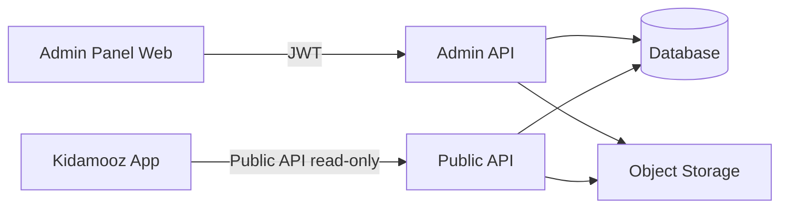

# پنل ادمین کیداموز — سند طراحی و پیاده‌سازی

این سند راهنمای ساخت **پنل ادمین** و **Backend API** است که اپ موبایل Kidamooz از آن محتوا می‌گیرد.

## اهداف

- مدیریت دسته‌ها و قصه‌ها (CRUD) از طریق وب
- آپلود کاور و فایل صوتی
- انتشار محتوا به اپ موبایل بدون نیاز به آپدیت اپ
- invalidate کردن کش اپ با تغییر `catalog.version`
- پشتیبانی دو زبانه (فارسی / انگلیسی)

## معماری کلی



| لایه | نقش |
|------|-----|
| Admin Panel | UI برای تیم محتوا |
| Admin API | CRUD، آپلود، publish، احراز هویت |
| Public API | فقط خواندن برای اپ موبایل |
| Object Storage | فایل کاور (image) و صوت (mp3/m4a) |
| Database | metadata، نسخه کاتالوگ، وضعیت publish |

اپ موبایل **مستقیم** به پنل ادمین وصل نمی‌شود. فقط Public API را صدا می‌زند.

## ارتباط با اپ موبایل (قرارداد فعلی)

اپ از [`StoryApiService`](../src/app/core/services/story-api.service.ts) و [`StoryCatalogStore`](../src/app/core/services/story-catalog.store.ts) استفاده می‌کند.

### Public API — اپ موبایل

| Method | Endpoint | پاسخ |
|--------|----------|------|
| GET | `/api/v1/catalog/version` | `{ version, updatedAt }` |
| GET | `/api/v1/categories` | `Category[]` |
| GET | `/api/v1/stories` | `{ items: Story[], total }` |
| GET | `/api/v1/stories/:id` | `StoryDetail` |

Query پارامترهای `stories`:

- `categoryId` (optional)
- `page` (optional, default: 1)
- `limit` (optional)

### منطق کش در اپ

1. cold start → hydrate از دیسک
2. background → `GET /catalog/version`
3. اگر `version` عوض شده یا TTL (۶ ساعت) گذشته → fetch کامل categories + stories
4. فقط **metadata JSON** کش می‌شود (سقف ~۱MB) — صوت و تصویر binary خودکار دانلود نمی‌شود

**نکته مهم برای backend:** هر بار که محتوای publish‌شده تغییر می‌کند، `catalog.version` باید عوض شود (مثلاً hash یا timestamp).

---

## مدل داده

### Category

```typescript
interface Category {
  id: string;          // slug-like: forest, space
  title: LocalizedText;
  slug: string;
  iconUrl: string;     // URL عمومی CDN/storage
  color: string;       // hex: #7bc950
  sortOrder: number;
  published: boolean;
}

interface LocalizedText {
  fa: string;
  en: string;
}
```

### Story

```typescript
interface Story {
  id: string;
  title: LocalizedText;
  description: LocalizedText;
  coverUrl: string;
  audioUrl: string;
  durationSeconds: number;
  ageMin: number;
  ageMax: number;
  categoryId: string;
  featured: boolean;
  sortOrder: number;
  published: boolean;
  publishedAt?: string; // ISO
}

interface StoryChapter {
  title: LocalizedText;
  startSeconds: number;
  imageUrl: string;
}

interface StoryDetail extends Story {
  chapters?: StoryChapter[];
}
```

### CatalogVersion

```typescript
interface CatalogVersion {
  version: string;    // مثال: "2026-07-09T12:00:00Z" یا hash
  updatedAt: string;  // ISO
}
```

### نگاشت به مدل فعلی اپ

مدل‌های فعلی اپ در [`category.model.ts`](../src/app/core/models/category.model.ts) و [`story.model.ts`](../src/app/core/models/story.model.ts) فیلد `title` تکی دارند. برای production باید یکی از این دو کار انجام شود:

1. **پیشنهادی:** API فیلدهای `titleFa` / `titleEn` (و مشابه برای description) برگرداند و اپ بر اساس زبان کاربر انتخاب کند.
2. **موقت:** API همان `title` فارسی را برگرداند تا mock فعلی کار کند.

امروز متن قصه‌ها در [`src/assets/i18n/`](../src/assets/i18n/) هم هاردکد شده‌اند. با فعال شدن backend، اپ باید عنوان/توضیح را از API بخواند نه از i18n JSON.

---

## Admin API (پیشنهادی)

Base path: `/api/v1/admin`

همه endpointها نیاز به `Authorization: Bearer <token>` دارند.

### Auth

| Method | Endpoint | توضیح |
|--------|----------|-------|
| POST | `/auth/login` | `{ email, password }` → `{ accessToken, refreshToken }` |
| POST | `/auth/refresh` | تمدید token |
| POST | `/auth/logout` | ابطال refresh token |

### Categories

| Method | Endpoint | توضیح |
|--------|----------|-------|
| GET | `/categories` | لیست همه (شامل draft) |
| POST | `/categories` | ایجاد |
| PUT | `/categories/:id` | ویرایش |
| DELETE | `/categories/:id` | حذف نرم (soft delete) |
| POST | `/categories/:id/publish` | انتشار |

### Stories

| Method | Endpoint | توضیح |
|--------|----------|-------|
| GET | `/stories` | لیست با فیلتر و pagination |
| GET | `/stories/:id` | جزئیات |
| POST | `/stories` | ایجاد draft |
| PUT | `/stories/:id` | ویرایش |
| DELETE | `/stories/:id` | حذف نرم |
| POST | `/stories/:id/publish` | انتشار → bump `catalog.version` |
| PUT | `/stories/:id/chapters` | ویرایش فصل‌ها |

### Media Upload

| Method | Endpoint | توضیح |
|--------|----------|-------|
| POST | `/media/upload-url` | presigned URL برای آپلود مستقیم به S3/MinIO |
| POST | `/media/confirm` | تأیید آپلود و ثبت URL نهایی |

فلو آپلود پیشنهادی:

1. ادمین فایل را انتخاب می‌کند
2. پنل `upload-url` می‌گیرد
3. فایل مستقیم به storage آپلود می‌شود
4. `confirm` → URL عمومی در story/category ذخیره می‌شود

فرمت‌های مجاز:

- کاور: `webp`, `jpg`, `png` — حداکثر ۲MB
- صوت: `mp3`, `m4a` — حداکثر ۵۰MB (قابل تنظیم)

### Catalog

| Method | Endpoint | توضیح |
|--------|----------|-------|
| GET | `/catalog/version` | همان خروجی Public API |
| POST | `/catalog/rebuild-version` | دستی bump نسخه (اختیاری) |

---

## منطق Publish و Version

هر عملیات زیر باید `catalog.version` را به‌روز کند:

- publish / unpublish قصه
- publish / unpublish دسته
- ویرایش فیلدهای قصه publish‌شده (title, audio, cover, category)
- حذف قصه publish‌شده

پیاده‌سازی پیشنهادی:

```sql
-- جدول singleton
catalog_meta (
  id INT PRIMARY KEY DEFAULT 1,
  version VARCHAR(64) NOT NULL,
  updated_at TIMESTAMPTZ NOT NULL
)
```

هنگام publish:

```text
version = sha256(updated_at + published_story_count + published_category_count)
```

Public API فقط رکوردهای `published = true` را برمی‌گرداند.

---

## پنل ادمین — صفحات MVP

### فاز ۱ (حداقل قابل استفاده)

- [ ] Login / Logout
- [ ] داشبورد: تعداد قصه‌ها، آخرین publish، نسخه کاتالوگ
- [ ] لیست دسته‌ها + ایجاد/ویرایش
- [ ] لیست قصه‌ها + ایجاد/ویرایش
- [ ] آپلود کاور و صوت
- [ ] دکمه Publish / Unpublish
- [ ] پیش‌نمایش موبایل (اختیاری): لینک به story در اپ

### فاز ۲

- [ ] مرتب‌سازی drag & drop (sortOrder)
- [ ] Featured stories
- [ ] فصل‌های قصه (chapters)
- [ ] فیلتر سن (ageMin / ageMax)
- [ ] تاریخچه تغییرات (audit log)

### فاز ۳

- [ ] چند ادمین / نقش (editor, admin)
- [ ] زمان‌بندی publish
- [ ] آمار پخش (اگر analytics اضافه شد)

---

## پیشنهاد استک فنی

### Backend

| گزینه | مزیت |
|-------|------|
| **NestJS + PostgreSQL** | TypeScript مشترک با Angular، ساختار ماژولار |
| Laravel + MySQL | سرعت توسعه CRUD و فایل |
| Supabase | Auth + DB + Storage آماده |

### Admin Panel UI

| گزینه | مزیت |
|-------|------|
| **Angular (همان monorepo)** | اشتراک مدل/type با اپ |
| React + Refine / React Admin | CRUD سریع |
| Retool / Appsmith | MVP خیلی سریع (کمتر customizable) |

### Storage

- Production: S3, Cloudflare R2, یا MinIO
- Dev: MinIO local

### Hosting

- API: Railway, Fly.io, VPS
- CDN: Cloudflare جلوی storage

---

## طرح دیتابیس (خلاصه)

```text
users
  id, email, password_hash, role, created_at

categories
  id, slug, title_fa, title_en, icon_url, color,
  sort_order, published, deleted_at, created_at, updated_at

stories
  id, category_id, title_fa, title_en, description_fa, description_en,
  cover_url, audio_url, duration_seconds,
  age_min, age_max, featured, sort_order,
  published, published_at, deleted_at, created_at, updated_at

story_chapters
  id, story_id, title_fa, title_en, start_seconds, image_url, sort_order

catalog_meta
  id, version, updated_at
```

---

## امنیت

- Admin API جدا از Public API (subdomain یا path)
- Rate limit روی login
- Presigned URL با expiry کوتاه (۵–۱۵ دقیقه)
- Validate MIME type سمت سرور
- CORS: فقط دامنه پنل ادمین
- Public API: فقط GET، بدون auth

---

## Environment اپ موبایل

وقتی backend آماده شد:

```typescript
// environment.prod.ts
export const environment = {
  production: true,
  apiBaseUrl: 'https://api.kidamooz.com',
  useMock: false,
};
```

---

## چک‌لیست یکپارچه‌سازی با اپ

- [ ] `GET /api/v1/catalog/version` پیاده‌سازی شده
- [ ] `GET /api/v1/categories` فقط published
- [ ] `GET /api/v1/stories` با pagination
- [ ] publish در ادمین → version عوض می‌شود
- [ ] اپ با `useMock: false` تست شده
- [ ] فیلدهای دو زبانه در API و اپ wire شده (جایگزین i18n content.stories)
- [ ] URLهای media از HTTPS و CORS-safe هستند

---

## مسیر پیشنهادی توسعه

```text
1. Backend: Public API read-only + catalog.version (با داده seed)
2. اپ: useMock=false و تست end-to-end
3. Admin API: auth + CRUD categories/stories
4. Admin UI: فرم‌های CRUD + upload
5. Publish flow + version bump
6. حذف mock data و i18n content.stories از اپ
```

---

## فایل‌های مرجع در این ریپو

| فایل | موضوع |
|------|--------|
| [`src/app/core/services/story-api.service.ts`](../src/app/core/services/story-api.service.ts) | قرارداد Public API |
| [`src/app/core/services/story-catalog.store.ts`](../src/app/core/services/story-catalog.store.ts) | کش و sync |
| [`src/app/core/config/cache-policy.ts`](../src/app/core/config/cache-policy.ts) | سقف حجم کش |
| [`src/app/core/data/mock-data.ts`](../src/app/core/data/mock-data.ts) | نمونه داده seed |
| [`src/app/core/models/`](../src/app/core/models/) | TypeScript models |
